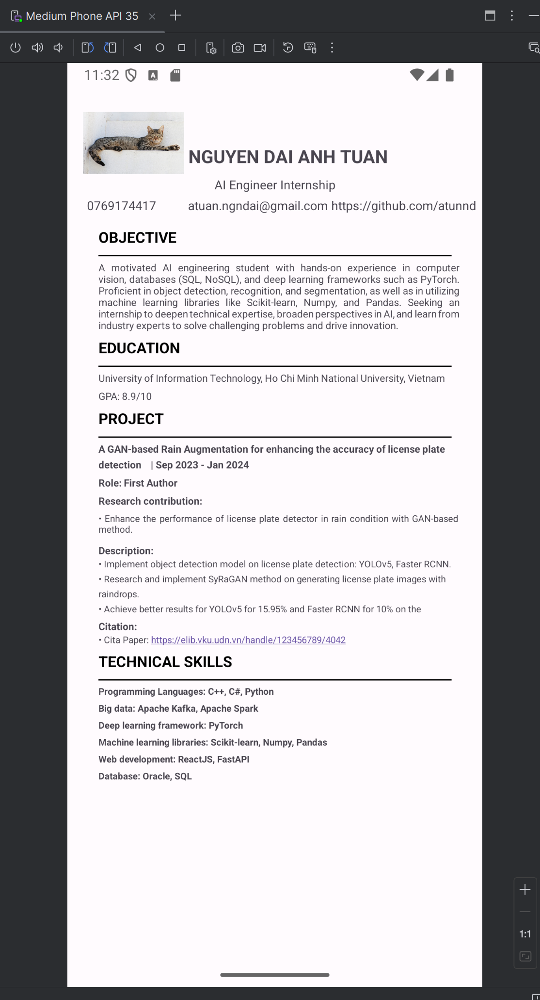

# mobile_exercise
This repository stores my exercise for mobile class

- Exercise 1: Creating my CV

- Exercise 2: Creating an application for conducting sentiment analysis from input text using Google API: https://ai.google.dev/prompts/sentiment-analysis

    
    

